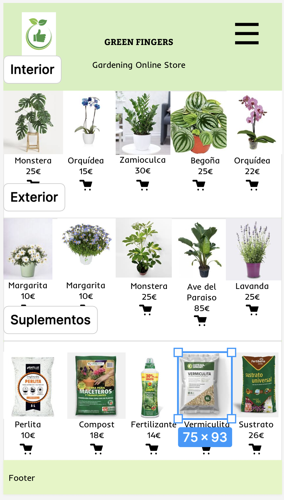
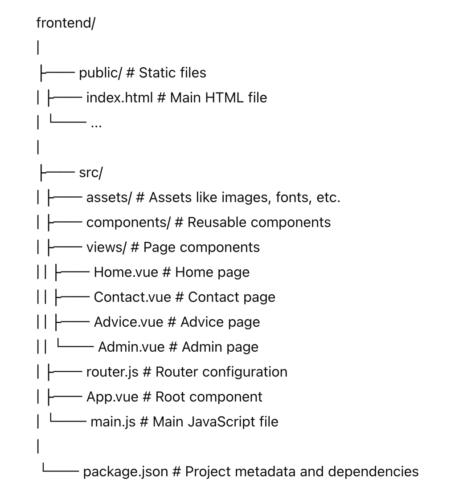

# Documentation Front-End Green Fingers Project

This is the frontend application for the **Green Fingers Gardening Online Store** project. It is built with Vue.js and provides a user-friendly interface for customers to buy plants, view gardening information, and get in touch with the store. Additionally, an admin panel is available for managing products.

## Future Plans

In the future, we plan to enhance the platform with interactive community features. As gardeners love to exchange plants and participate in social events or workshops, we aim to introduce:

- **Community Forums:** A place where users can share tips, advice, and experiences.
- **Plant Exchange:** A platform for users to trade plants with each other.
- **Event Calendar:** A feature to promote and manage gardening workshops and social events.

## Layout 

## Features

- **Home Page:** Displays a list of products with options to filter by categories. Users can browse and add items to their cart.
- **Contact Page:** Provides a contact form for customers to reach out for inquiries or support.
- **Advice Page:** Offers expert advice on choosing the right gardening products and tips for plant care.
- **Admin Dashboard:** Allows admin users to add, update, and delete products, manage inventory, and review sales statistics.

## Components

### **Navbar**

- **Description:** Allows the user to navigate through the menu, choosing the different views of the page.
- **Responsive Design:** It is displayed as a ‘hamburger menu’ on mobile devices and as a horizontal bar on larger screens.

### **Header**

- **Description:** Shows the corporate section of the app with the logo and company name.
- **Cart Integration:** It is related to the Cart component as the cart icon is displayed in the Header.

### **ProductCard**

- **Description:** Displays product information such as image, price, and category.
- **Functionality:** Allows users to add products to the shopping cart by clicking on them.

### **Cart**

- **Description:** Gathers the list of products that the customer wishes to purchase.
- **Integration:** Related to Header and ProductCard for seamless shopping experience.

### **Footer**

- **Description:** Displays links to the store's social media profiles and links to the developer's profile for collaboration opportunities.

## Technologies Used

- **Vue.js 3:** A progressive JavaScript framework for building user interfaces.
- **Vue Router:** Official router for Vue.js for navigation between pages.
- **Tailwind CSS:** A utility-first CSS framework for styling.
- **FontAwesome:** Icon library for adding vector icons.
- **Git & GitHub:** Version control and collaboration platform.

## Project Structure

The project follows a structured approach to ensure maintainability and scalability:

- **`src/components`**: Contains reusable Vue components.
- **`src/views`**: Defines the main pages of the application.
- **`src/router`**: Manages navigation between views using Vue Router.
- **`src/store`**: Handles state management if needed (Vuex or Pinia can be used).
- **`public`**: Contains static assets like images and favicon.

## Setup and Installation

Follow these steps to set up and run the frontend application locally:

1. **Clone the repository:**

bash
   git clone https://github.com/IngridDLT/GREEN_FINGERS_FINAL_PROJECT.git

2. **Navigate to the project directory:**

cd green_fingers_final_project

 3. **Install the dependencies:**

 npm install

 4. **Run the development server:**

 npm run dev

 The application will be available at http://localhost:5173.

## Usage

**Home Page**

    View Products: Browse the selection of gardening products.
    Filter by Category: Narrow down product choices by selecting categories like Interior, Exterior, and Supplement.

**Contact Page**

    Contact Form: Fill out the form to send a message or inquiry to the store team.
    Responsive Design: The form adjusts seamlessly across devices for ease of use.

**Advice Page**

    Gardening Tips: Read articles and advice on plant care and gardening products.
    Expert Recommendations: Gain insights from experienced gardeners and industry experts.

**Admin Dashboard**

    Manage Products: Admin users can add, update, and delete products from the inventory.
    Sales Overview: View statistics and insights related to product sales and performance.

**Contribution Guidelines**

We welcome contributions to enhance the Green Fingers project. If you would like to contribute, please follow these guidelines:

    Fork the repository and create a new branch for your feature or bugfix.
    Submit a pull request with a detailed description of the changes you have made.
    Ensure that your code follows the project's coding style and conventions.
    Include relevant tests for new features or changes.

**Future Enhancements**

    User Authentication: Implement secure login and registration for users.
    Community Features: Enable a social platform for plant exchanges and event organization.
    Wishlist Functionality: Allow users to save favorite products for future purchases.

**Contact**

For further information, please contact the developer at:

    Email: ingriddelatorre@gmail.com
    LinkedIn: https://www.linkedin.com/in/ingrid-de-la-torre-12726327/